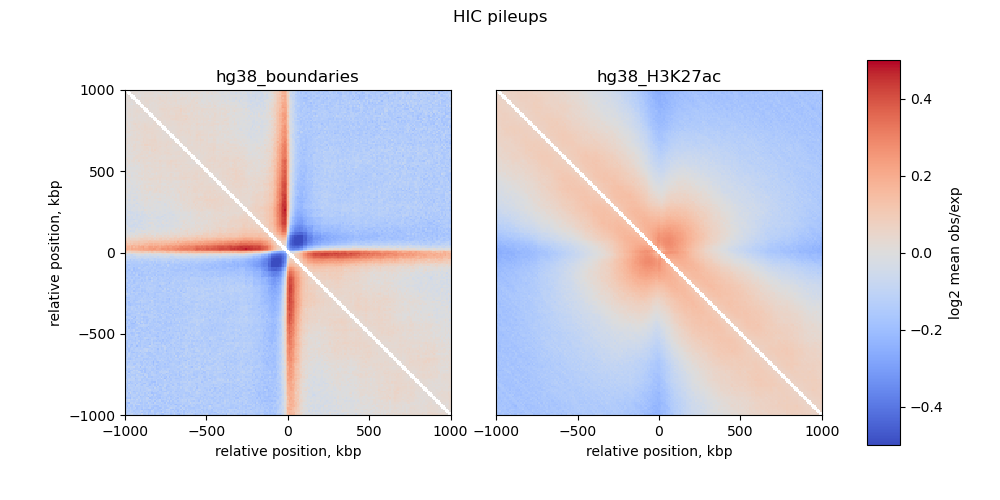

# hicpileup

hicpileup uses [https://github.com/open2c/cooler] to plot the observed/expected HIC signal piled up around a BED file of features

## Dependencies

All dependencies to run the script  can be downloaded using conda: 

```
conda create -n pileupenv -c bioconda cooltools numpy cython bioframe
conda activate pileupenv
./hicpileup.py -h
```

## Usage

```
$ ./hicpileup.py
usage: hicpileup.py [-h] -c COOLER -cs CSIZES -fs [FEATURES [FEATURES ...]]
                    -fn [FEATURENAMES [FEATURENAMES ...]] -of OUTFILE
                    [-bs BINSIZE] [-t THREADS]

Create HIC pileups around regions to aggregate

optional arguments:
  -h, --help            show this help message and exit
  -c COOLER, --cooler COOLER
                        coolerData
  -cs CSIZES, --csizes CSIZES
                        chrom-sizes file
  -fs [FEATURES [FEATURES ...]], --features [FEATURES [FEATURES ...]]
                        feature files
  -fn [FEATURENAMES [FEATURENAMES ...]], --featureNames [FEATURENAMES [FEATURENAMES ...]]
                        names for each feature file, used as plot labels
  -of OUTFILE, --outfile OUTFILE
                        output figure name
  -bs BINSIZE, --binsize BINSIZE
                        cooler binsize
  -t THREADS, --threads THREADS
                        threads for processing pool
```


# Example output using two feature files:




